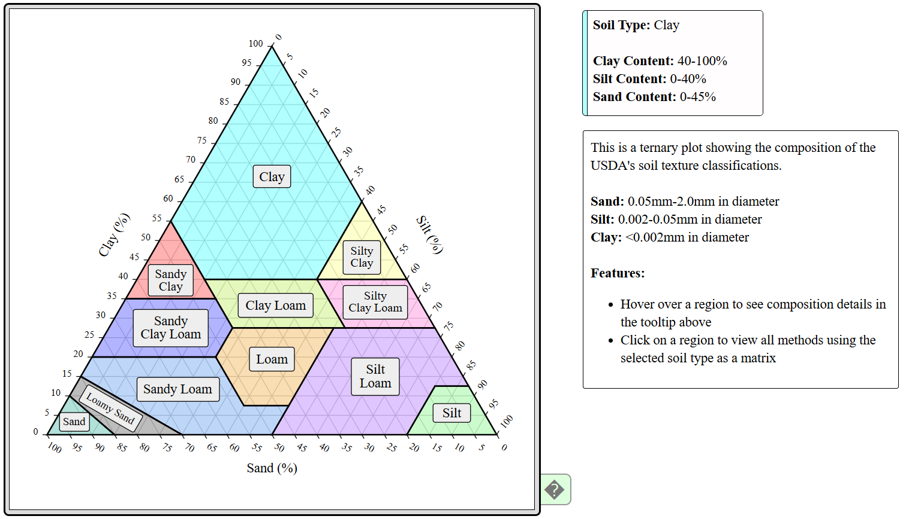

# Soil Classification Ternary Plot

**Author:** E. Tyler Carr

This is a ternary plot showing the different USDA soil texture classifications based on their composition of clay, sand and silt.

## Dependencies

This project requires the following libraries:

- [D3.js](https://d3js.org/) (version 7)

## Functionality

Hovering over a section of the plot will populate the tooltip in the top right with information about that texture classification. Clicking a section of the plot will take you to the list of methods on the EPA's Analytical Methods and Open Spectra database's webpage with the matrix column filtered for that soil type. There is a help button in the bottom right that will toggle a help tooltip on and off.

## Licensing

The code in this repository is licensed under the [CC0 1.0 Universal (CC0 1.0) Public Domain Dedication](./LICENSE).
